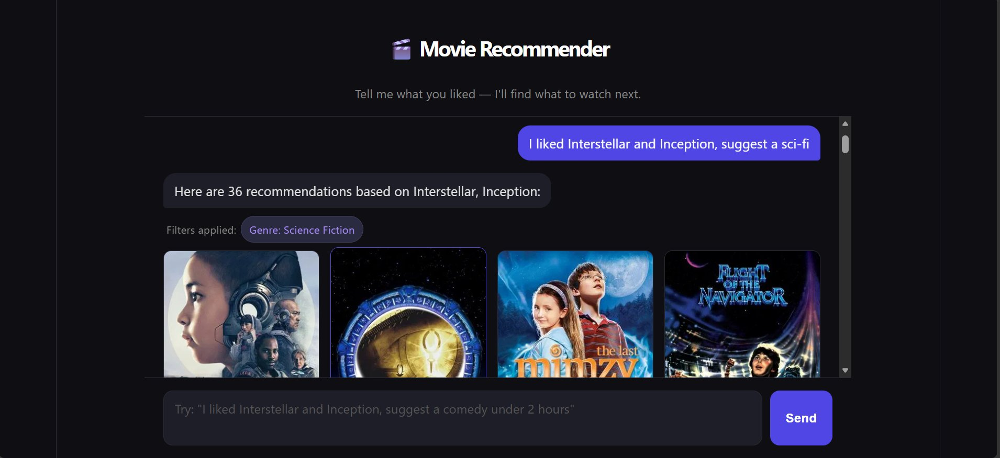
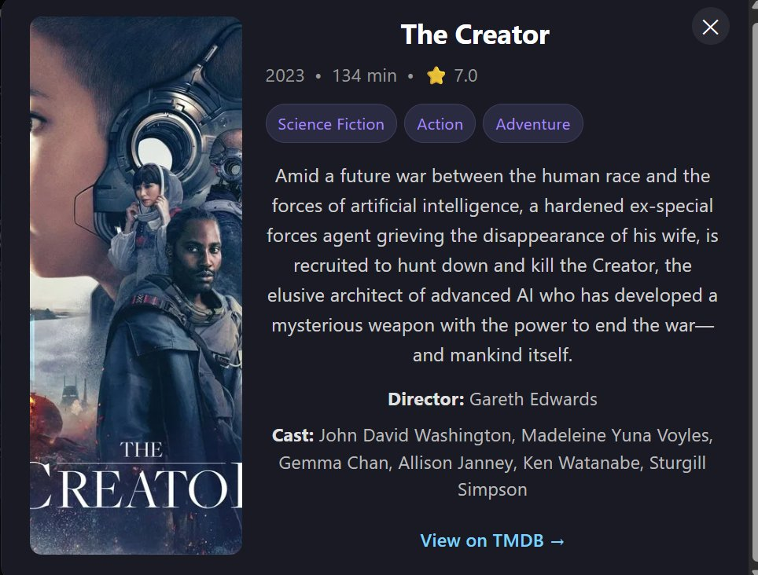

[README.md](https://github.com/user-attachments/files/29286265/README.md)
# 🎬 Movie Recommendation Chatbot

A conversational movie recommendation chatbot that understands natural language, remembers context across a conversation, and goes beyond simple recommendations to answer movie trivia, look up specific titles, and show trailers and streaming availability — including dedicated support for Indian cinema (Bollywood, Tamil, Telugu, Kannada, Malayalam).

Built as a full-stack portfolio project using **only free-tier services** — no paid APIs, no credit card required anywhere in the stack.

---

## 📖 Table of Contents

- [Features](#-features)
- [Screenshots](#-screenshots)
- [Example Conversations](#-example-conversations)
- [Tech Stack](#-tech-stack)
- [Architecture](#%EF%B8%8F-architecture)
- [Getting Started](#-getting-started)
- [Project Structure](#%EF%B8%8F-project-structure)
- [API Endpoints](#-api-endpoints)
- [Indian Cinema Support](#-indian-cinema-support)
- [Known Limitations](#%EF%B8%8F-known-limitations)
- [Troubleshooting](#-troubleshooting)
- [What I Learned Building This](#-what-i-learned-building-this)

---

## ✨ Features

- **Conversational recommendations** — tell it movies you've liked across multiple messages ("I liked Interstellar and Inception" → "I also liked The Hangover") and it remembers the full running list for the rest of the conversation
- **Natural language filtering** — "comedy under 2 hours", "highly rated sci-fi", "Bollywood movies" — parsed into structured filters (genre, runtime, rating, language) automatically, no rigid command syntax required
- **Movie lookup** — type just a movie name, in any language, to get a full detail card: cast, director, trailer, and where to stream/rent/buy it
- **Movie trivia & general questions** — ask "who directed Inception?" or "is Interstellar good?" and get a direct conversational answer instead of a recommendation list
- **Chitchat handling** — greetings and "what can you do" get a friendly reply instead of being misread as a movie title search
- **Indian cinema support** — recognizes Bollywood/Tamil/Telugu/Kannada/Malayalam by name (and common industry nicknames like "Tollywood") and filters recommendations by language
- **Click-for-details modal** — every recommended movie card opens into a full detail view: poster, overview, genres, runtime, rating, director, top cast, embedded YouTube trailer, and India-region streaming providers (Netflix, Prime Video, Zee5, etc.) with Stream/Rent/Buy grouping
- **Intent-aware routing** — a single `/chat` endpoint classifies each incoming message into one of four intents (recommend / movie lookup / trivia / chitchat) and routes it to the right handler, instead of forcing every message through one rigid recommendation pipeline
- **"Start Over" reset** — clears the conversation memory and starts fresh at any point

---

## 📸 Screenshots

**Conversational filtering with genre/runtime detection:**



*The bot extracted "Genre: Science Fiction" from a natural sentence and applied it to the recommendation results.*

**Click-for-details modal with cast and trailer:**



*Clicking any movie card opens a full detail view with director, cast, and a link to TMDB. (Trailer and streaming sections appear below this in the live app.)*

---

## 💬 Example Conversations

The bot handles several different conversational patterns through the same chat interface:

```
You: I liked Interstellar and Inception
Bot: Here are 36 recommendations based on Interstellar, Inception: [movie cards]

You: now show me a comedy
Bot: Here are 4 recommendations based on Interstellar, Inception: [filtered cards]

You: I also liked The Hangover
Bot: Here are 47 recommendations based on Interstellar, Inception, The Hangover: [movie cards]
```

```
You: RRR
Bot: Here's what I found for RRR: [opens detail modal with trailer + streaming info]
```

```
You: who directed Inception?
Bot: Christopher Nolan directed Inception. It was released in 2010...
```

```
You: hi
Bot: Hello there! It's great to hear from you. How can I help you today?
```

```
You: recommend Bollywood movies
Bot: Here are 20 recommendations: [Hindi-language movies via TMDB discover]
```

---

## 🧱 Tech Stack

| Layer | Technology |
|---|---|
| Backend | Python, FastAPI, Uvicorn |
| Frontend | React (Vite) |
| Movie data | [TMDB API](https://www.themoviedb.org/documentation/api) — search, recommendations, details, credits, videos, watch providers, discover |
| Natural language understanding | Google Gemini (`gemini-2.5-flash-lite`, free tier) via the `google-genai` SDK |
| HTTP client (backend → TMDB/Gemini) | `requests` |
| Styling | Plain CSS, custom dark theme (no framework) |

**Why these choices:**
- **TMDB** has a genuinely free, no-credit-card API that covers search, recommendations, cast/crew, trailers, and regional streaming availability — including full coverage of Indian cinema.
- **Gemini** was chosen over OpenAI specifically because its free tier requires no credit card at all. OpenAI's API needs billing set up even for trial usage, which didn't fit the "free tier only" constraint for this project.
- Within Gemini's lineup, `gemini-2.5-flash-lite` was chosen over `gemini-2.5-flash` because the latter's free-tier daily quota (20 requests/day in testing) was hit very quickly during development; `flash-lite` has a higher daily allowance and is more than capable for structured extraction tasks like intent classification and filter parsing.

---

## 🏗️ Architecture

```
┌─────────────┐                ┌────────────────────┐                ┌─────────────┐
│   React     │── /chat ──────►│   FastAPI Backend   │── search/recs ─►│   TMDB API  │
│  (Vite)     │◄── JSON ───────│                     │◄── movie data ──│             │
└─────────────┘                │  1. Intent router   │                └─────────────┘
                                │  2. Filter parser   │                ┌─────────────┐
                                │  3. Memory merge    │── classify ────►│ Gemini API  │
                                │  4. Apply filters   │◄── intent/JSON ─│             │
                                └────────────────────┘                └─────────────┘
```

### Request flow for `/chat`

Every message sent to `/chat` goes through this pipeline:

1. **Intent classification** (Gemini) — the message is classified into exactly one of:
   - `recommend` — stating liked movies, asking for recommendations, or giving a filter
   - `movie_lookup` — naming one specific movie with no "I liked" framing
   - `movie_question` — factual/trivia/opinion questions about movies, actors, directors
   - `chitchat` — greetings, thanks, meta questions about the bot itself

2. **Branch by intent:**
   - **`chitchat` / `movie_question`** → Gemini answers directly in plain text, no TMDB calls needed
   - **`movie_lookup`** → Gemini extracts the title → TMDB search → movie ID returned so the frontend opens the detail modal automatically
   - **`recommend`** → Gemini extracts any *new* movie titles and any filter text from the message → new titles are merged with the `known_titles` list already tracked by the frontend (case-insensitive dedupe) → TMDB recommendations are fetched for every known title and merged/deduplicated → if a filter was mentioned, Gemini parses it into structured fields (genre, runtime, rating, language) → results are filtered accordingly

3. **Special case — language/genre request with no liked movies yet** (e.g. first message is "recommend Bollywood movies"): instead of requiring a reference movie, the backend calls TMDB's `/discover/movie` endpoint directly with the parsed language/genre/rating filters.

### Why a single intent-routed endpoint instead of separate ones per feature?

Early in development, the frontend tried to guess intent itself using regex (splitting "I liked X, show me a comedy" into a title part and a filter part by keyword matching). This broke constantly — phrases like "now show me a comedy" or "I also liked The Hangover" don't contain any of the hardcoded keywords the regex was looking for, so they got misparsed as movie titles. Moving *all* natural-language understanding to the backend (via Gemini) and giving the frontend one single endpoint to call removed an entire category of bugs and made the system robust to phrasing the original regex never anticipated.

---

## 🚀 Getting Started

### Prerequisites

- **Python 3.10+**
- **Node.js 18+** and npm
- A free [TMDB API key](https://www.themoviedb.org/settings/api) (Settings → API → Request an API Key → Developer)
- A free [Google Gemini API key](https://aistudio.google.com/) (click "Get API key" — no credit card required)

### 1. Clone the repository

```bash
git clone https://github.com/skandaaa/movie-recommender-chatbot.git
cd movie-recommender-chatbot
```

### 2. Backend setup

```bash
cd backend
python -m venv venv
```

Activate the virtual environment:

```bash
# Windows (PowerShell)
venv\Scripts\activate

# macOS/Linux
source venv/bin/activate
```

You should see `(venv)` appear at the start of your terminal prompt. Then install dependencies:

```bash
pip install -r requirements.txt
```

Create a `.env` file inside `backend/` with your two API keys:

```
TMDB_API_KEY=your_tmdb_key_here
GEMINI_API_KEY=your_gemini_key_here
```

> **Windows tip:** Notepad sometimes saves this as `.env.txt` instead of `.env`, which the app won't read. Create it from PowerShell instead to avoid this:
> ```powershell
> notepad .env
> ```
> Click "Yes" when prompted to create the file, paste in the two lines above, save, and verify with `Get-Content .env` — it should print both lines back exactly.

Run the backend:

```bash
uvicorn main:app --reload
```

The API will be live at `http://127.0.0.1:8000`. Interactive Swagger docs (useful for testing endpoints directly) are at `http://127.0.0.1:8000/docs`.

### 3. Frontend setup

Open a **second terminal** (leave the backend running in the first one):

```bash
cd frontend
npm install
npm run dev
```

Open `http://localhost:5173` in your browser.

> **Note:** the frontend defaults to calling `http://127.0.0.1:8000`. This is correct for local development out of the box — no extra configuration needed. If you later deploy the backend somewhere else, set `VITE_API_URL` in a `.env` file inside `frontend/` to point at that deployed URL instead.

### 4. Try it out

With both servers running, type into the chat:

```
I liked Interstellar and Inception
```

You should see movie recommendation cards appear within a few seconds.

---

## 🗂️ Project Structure

```
movie-recommender-chatbot/
├── backend/
│   ├── main.py            # FastAPI app: /chat, /recommend, /movie/{id} endpoints
│   ├── tmdb_client.py     # TMDB API wrapper (search, recommendations, details,
│   │                      #   credits, videos, watch providers, discover)
│   ├── llm_client.py      # Gemini wrapper: intent classification, title/filter
│   │                      #   extraction, trivia answers, chitchat replies
│   └── requirements.txt
├── frontend/
│   └── src/
│       ├── App.jsx        # Chat UI, movie cards, detail modal, conversation memory
│       └── App.css        # Dark theme styling
├── screenshots/
└── README.md
```

---

## 🔌 API Endpoints

| Endpoint | Method | Purpose |
|---|---|---|
| `/chat` | POST | Main conversational endpoint. Takes `{message, known_titles}`. Returns an intent-routed response: text reply, movie lookup, or recommendation list. |
| `/recommend` | POST | Direct recommendation endpoint (no intent routing). Takes `{titles, filter_text}`. |
| `/movie/{id}` | GET | Full detail card for one movie: overview, genres, runtime, director, cast, trailer key, and India watch providers. |

Full interactive documentation — including request/response schemas you can test directly in the browser — is available at `/docs` once the backend is running (FastAPI's built-in Swagger UI).

### Example `/chat` request/response

```json
// POST /chat
{
  "message": "I liked Interstellar, suggest a comedy under 2 hours",
  "known_titles": []
}
```

```json
// Response
{
  "reply_type": "recommendations",
  "text": "",
  "recommendations": [ /* array of movie objects */ ],
  "total": 4,
  "filters_applied": {
    "genre": "Comedy",
    "max_runtime_minutes": 120,
    "min_runtime_minutes": null,
    "min_rating": null,
    "language": null,
    "language_code": null
  },
  "not_found": [],
  "known_titles": ["Interstellar"],
  "needs_titles": false
}
```

---

## 🌏 Indian Cinema Support

TMDB's search and recommendation engine already covers Bollywood, Tamil, Telugu, Kannada, and Malayalam films natively — searching "RRR", "Pathaan", "3 Idiots", or "Dangal" returns correct results with no special handling needed.

On top of that, the bot recognizes spoken language/industry names and maps them to TMDB's ISO 639-1 language codes for filtering:

| Term | Maps to |
|---|---|
| Hindi, Bollywood | `hi` |
| Tamil, Kollywood | `ta` |
| Telugu, Tollywood | `te` |
| Kannada, Sandalwood | `kn` |
| Malayalam, Mollywood | `ml` |

Try:
- *"recommend Bollywood movies"* (no reference movie needed — uses TMDB's discover endpoint directly)
- *"highly rated Tamil films"*
- *"I liked RRR, suggest something in Telugu"*
- Just type any Indian movie title directly to get its full detail card with trailer and streaming info

---

## ⚠️ Known Limitations

- **Gemini free-tier daily quota**: the free tier allows a limited number of requests per day per model. Since every chat message costs at least one Gemini call (intent classification), and sometimes two (title/filter extraction or trivia answering), heavy testing in a single day can exhaust the quota. The app retries automatically with backoff on rate-limit errors, but a fully exhausted daily quota will surface as an error until it resets (quotas reset roughly every 24 hours).
- **Streaming availability**: watch provider data is sourced from JustWatch via TMDB and defaults to the India region. Availability isn't guaranteed for every title, can vary by region, and may be incomplete or out of date.
- **Cold dependency on two external APIs**: if either TMDB or Gemini is slow or briefly unavailable, that specific request will be slow or fail — there's no offline fallback for recommendation data.
- **Local-first**: this project is designed to be run locally per the setup instructions above.

---

## 🐛 Troubleshooting

A few issues that came up repeatedly during development, in case you hit them too:

**"Something went wrong. Make sure the backend is running on port 8000."**
This is the frontend's generic error for *any* failed request to the backend. Most common causes:
- The backend (`uvicorn main:app --reload`) isn't running, or its terminal window was closed
- The frontend's `API_BASE_URL` is pointed at the wrong place — check the top of `App.jsx`

**`ModuleNotFoundError: No module named 'dotenv'` (or similar)**
Your virtual environment isn't activated. Run `venv\Scripts\activate` (Windows) or `source venv/bin/activate` (macOS/Linux) — you should see `(venv)` in your prompt before running Python commands.

**`google.genai.errors.ClientError: 429 RESOURCE_EXHAUSTED`**
You've hit Gemini's daily free-tier quota for that model. Either wait for it to reset (~24 hours) or reduce testing volume. This is expected behavior on the free tier, not a bug.

**`.env` file not being read / API key showing as `None`**
On Windows, Notepad sometimes saves `.env` as `.env.txt`, or typing the key directly into PowerShell runs it as a command instead of writing it to a file. Create the file via `notepad .env` from inside the `backend` folder (let it prompt you to create a new file), and verify with `Get-Content .env`.

**Dependency conflicts when installing on a deployment platform (e.g. Render)**
A `requirements.txt` generated with `pip freeze` captures every package ever installed in the environment, including unrelated leftovers, which can create version conflicts on a different OS. A minimal, hand-written `requirements.txt` listing only the packages actually imported in the code (`fastapi`, `uvicorn[standard]`, `requests`, `python-dotenv`, `google-genai`) avoids this.

---

## 🛠️ What I Learned Building This

This project was built iteratively, one feature at a time, with a deliberate focus on understanding each piece rather than generating everything at once. Some of the more useful takeaways:

- **Letting an LLM handle ambiguity beats hand-written parsing rules.** An early version tried to split user messages into "movie titles" and "filter text" using regex and keyword lists. It broke on any phrasing the keyword list didn't anticipate. Replacing that with a single Gemini call that returns structured JSON (titles + filter) handled new phrasings correctly without needing to predict them in advance.
- **Prompt engineering for structured output matters more than expected.** Giving the model a fixed JSON shape, an explicit "return ONLY valid JSON" instruction, and a handful of worked examples made output far more reliable than a vague natural-language prompt.
- **Free-tier quotas are a real constraint to design around**, not just an inconvenience — they shaped model choice (`flash-lite` over `flash`) and are worth surfacing clearly to anyone running the project rather than treated as a rare edge case.
- **Centralizing API calls in dedicated client modules** (`tmdb_client.py`, `llm_client.py`) instead of scattering `requests` calls throughout the FastAPI routes made the codebase much easier to test and reason about independently of the web framework.
